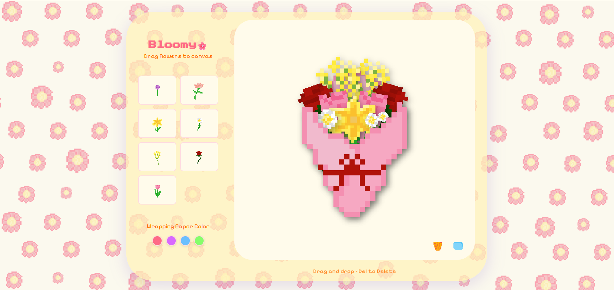

# Bloomy🌸 – Pixel Art Bouquet Maker

**Bloomy** is a cozy, web-based creative tool that allows users to design their own pixel art flower bouquets.  
Inspired by cottagecore aesthetics and retro digital art, this project aims to offer a relaxing and delightful way to create and share digital gifts.

> **Status:** Work in Progress.
> UI, asset set, and editor tools are still actively being developed.

---

## Live Demo
 **Live on Vercel:** [_see live demo_](https://cnkcsbloomy.vercel.app/)

---

## Preview

| Intro Page | Bouquet Editor Preview |
|--------------------|------------------------|
|  |  |

---

## Features

###  Asset Library
- Includes **7 hand-drawn pixel art flowers**.
- Additional flowers, stems, decorations, and backgrounds planned.

###  Canvas Rendering
- Pixel-perfect rendering using the HTML5 Canvas API with **no blurring**.
- Zoom in/out system currently in prototyping.

###  Bouquet Builder
- Add, move, remove, and reorder bouquet elements.
- Simple array-based state (may migrate to Zustand/Redux later).

###  Retro UI
- Clean, minimal, retro-inspired interface  

---

##  Tech Stack
- **HTML5 Canvas**
- **Vanilla JavaScript**
- **CSS (Retro UI)**

