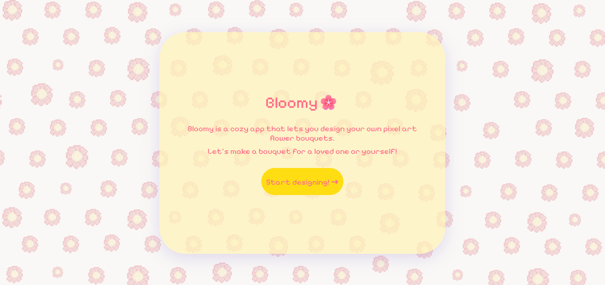

# Bloomy 🌸

Bloomy is a cozy, web-based creative tool that allows users to design their own pixel art flower bouquets. 
Inspired by the "cottagecore" aesthetic and retro digital art, this project aims to provide a relaxing experience for users to create and share digital gifts.

> **Status:** Work in Progress (MVP Phase)

## Features
* **Asset Library:** Currently includes 7 hand-drawn pixel art flowers.
* **Canvas Rendering:** Uses HTML5 Canvas API to render pixel-perfect assets without blurring.
* **Retro UI:** A clean, retro-styled interface.
* **State Management:** Basic JavaScript array-based state to track bouquet items.

> This is the initial preview
